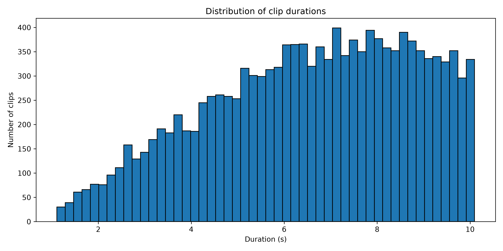
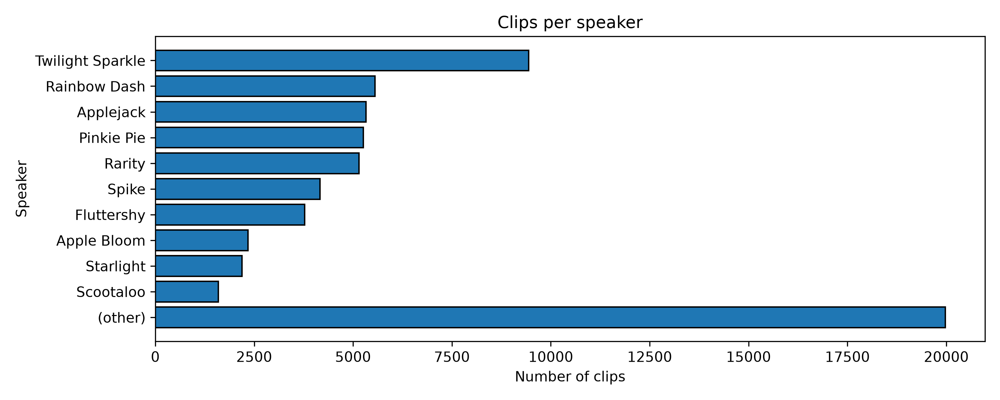
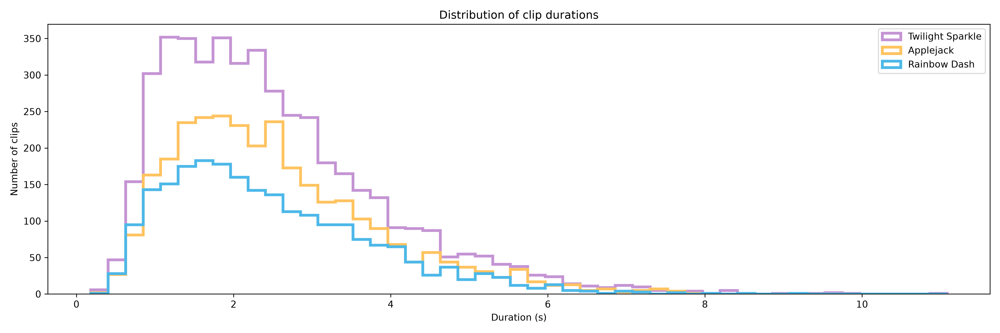

# Assignment 4

Yevhenii Zasko & Oleh Kovalyshyn

## EDA and Metric Analysis

LJSpeech is a one-speaker dataset of 13,100 samples read from non-fiction books. Dataset's README contains basic statistics:

| Metric | Value |
| --- | --- |
| Total Clips | 13,100 |
| Total Words | 225,715 |
| Total Characters | 1,308,674 |
| Total Duration | 23:55:17 |
| Mean Clip Duration | 6.57 sec |
| Min Clip Duration | 1.11 sec |
| Max Clip Duration | 10.10 sec |
| Mean Words per Clip | 17.23 |
| Distinct Words | 13,821 |

Some words are abbreviated in the transcript:

| Abbreviation | Expansion |
| --- | --- |
| Mr. | Mister |
| Mrs. | Misess (*) |
| Dr. | Doctor |
| No. | Number |
| St. | Saint |
| Co. | Company |
| Jr. | Junior |
| Maj. | Major |
| Gen. | General |
| Drs. | Doctors |
| Rev. | Reverend |
| Lt. | Lieutenant |
| Hon. | Honorable |
| Sgt. | Sergeant |
| Capt. | Captain |
| Esq. | Esquire |
| Ltd. | Limited |
| Col. | Colonel |
| Ft. | Fort |

* there's no standard expansion of "Mrs."

Dataset's sample rate is 22050. Clip duration distribution:

### Metrics

The proposed metrics are CER, UTMOS and SECS. All of them rely on another model that evaluates the output.

* **UTMOS** reflects speech naturalness and perception quality.
* **SECS** (Speaker Encoder Cosine Similarity) shows how much the original and generated voices are similar
* **CER** measures the difference between the original text and transcribed from the output.

A thing to note is that all these metrics rely on a good quality of the evaluating models. If Whisper makes an error during transcription, that could unfairly lower our model's score. At the same time, if the models recover the correct text even from low-quality outputs, it show model for better than it's actually worth.

An alternative metric to somewhat mitigate these limitations could be CER, but calculated not against the original, labeled text, but against the transcript of the input sample. The label-transcript CER then could also be used to detect potential problems with the data or Whisper.

## Validation

### Test/Train/Val Splits

Train and test splits were obtained by randomly splitting the dataset. 10% of the samples (1310) were included in the test fold. Then, validation fold was additionally carved out from train, with 10% of samples set out for the new split. Resultant statistics:

| Split | # Samples |
|-------|-----------|
| Train | 10 611    |
| Val   | 1 179     |
| Test  | 1 310     |

### Alternative Dataset

As an alternative dataset, synthbot's [pony-speech](https://huggingface.co/datasets/synthbot/pony-speech) dataset was used. It's a collection of labeled speech samples from My Little Pony TV Show. The dataset includes a total of 64.8K samples across 227 speakers.

We decided to focus only on the top-3 speakers to reproduce a dataset, similar to LJSpeech. This way, we created 3 different datasets for samples from Twilight Sparkle, Rainbow Dash and Applejack. Only non-noised samples were included. All samples were re-sampled to 22050 Hz. Resulting statistics:

| Dataset          | # Samples |
|------------------|-----------|
| Twilight Sparkle | 4 549     |
| Applejack        | 3 031     |
| Rainbow Dash     | 2 243     |
| **Total**        | **9 823** |

Durations distributions were similar across the datasets:

### LLM-generated Cases

For additional edge cases, we asked Claude to generate input texts and selected some of them. The generated texts include numbers, abbreviations, dates, heteronyms (past tense "read" vs present tense "read"), web urls, degenerate inputs (empty, emojis), etc.

## GPT TTS

## RLHF approach

## AI Use Disclosure
Claude Code was used to brainstorm ideas, generate plots and some scripts, validate approaches and debug code.

Our chats:
1. https://claude.ai/share/c8865b20-04a2-4afd-8e8b-86a987cdb03e
